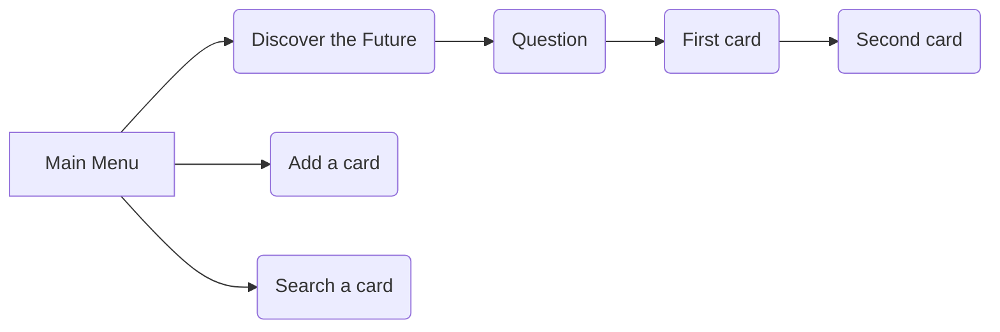

# Report of the tarot project

As its name suggests, the divinatory tarot is a form of cartomancia that has the particularity of using special cards to read the future. It helps clarify and helps to find the best solution to a given difficulty. The divinatory tarot is a divinatory art which uses the cards of the tarot of Marseilles.

The principle of the tarot is based on this: even if he ignores it, man holds in himself all the resources necessary to solve the problems of his life. Indeed, the human unconscious is much more powerful than one thinks, and contains all the answers to the concerns of existence. By the force of his unconscious, man thus proves to be omnipotent. It is the divine part that lives in each one, that knows all the answers and that, in fact, is symbolized by the soul.

 1. Analysis of the objective
 2. Organization
 3. Problems encountered

## Analysis of the objective

The goal is to create a tarot game in java language. First, you must be able to have control over the **management of cards**: add, search, modify and delete. 
This will require a **graphical interface**, with panels, buttons etc. 

At the divinatory tarot, there are several types of cards: the major arcanes and the minor arcanes. In our case, we will only use the **major arcanes**, which number 22.

These cards will be used to **predict the player’s future**. This is the principle of the divinatory tarot.

So, after having realized a system of cards, we will be able to read the future, thanks to the tarot cards. 

In general, the person seeking answers asks a question. The question must be precise and clear. After this question, the cards come into play. The person will **draw 4 cards**, this is called the cross draw. This is the most used print because it is the simplest.

The first card drawn represents the consultant, the second represents the third person related to the issue (boss, spouse, friend, etc.), the third card represents the past (the circumstances that led to the situation), and finally, the fourth card represents the future, the solution to the problem.

## Organization

### The deck.
First, we will create the card system, with the creation of cards, searching, editing and deletion. It makes sense to start with this step before you start the draws.

The deck of cards with the major arcanes is created from the first two classes we will do: the **Cards** class and the **Deck** class.

In the Cards class, we declare the different properties that a card must have. The name of the card, its description, its meaning for the past, its meaning for the present, its meaning for the future and the corresponding image. You must also write the getters to retrieve the values of each card.

In the Deck class, we initialize the deck as an ArrayList. Then, we fill the arraylist of the 22 major arcanes in a method that consists of adding these cards in the package.

> The arraylist created is of **type Cards**.

In this Deck class, we create the method for creating, editing and deleting a card. For the edit and delete method, we pass a *parameter* to the method that will be *the name of the card*, in order to know which one the user wants to interact on.

### The graphical interface.

The graphical interface will work as follows :

